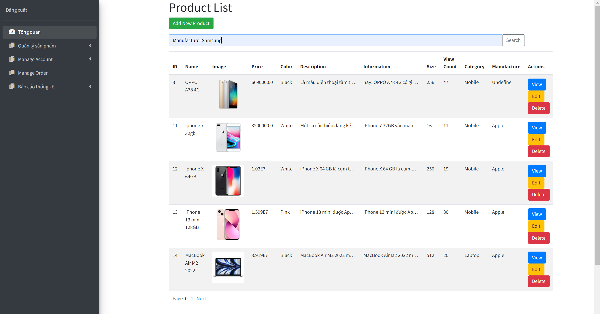
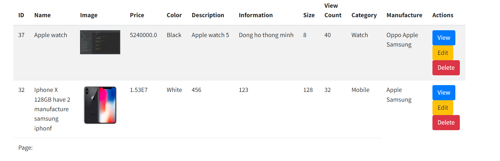
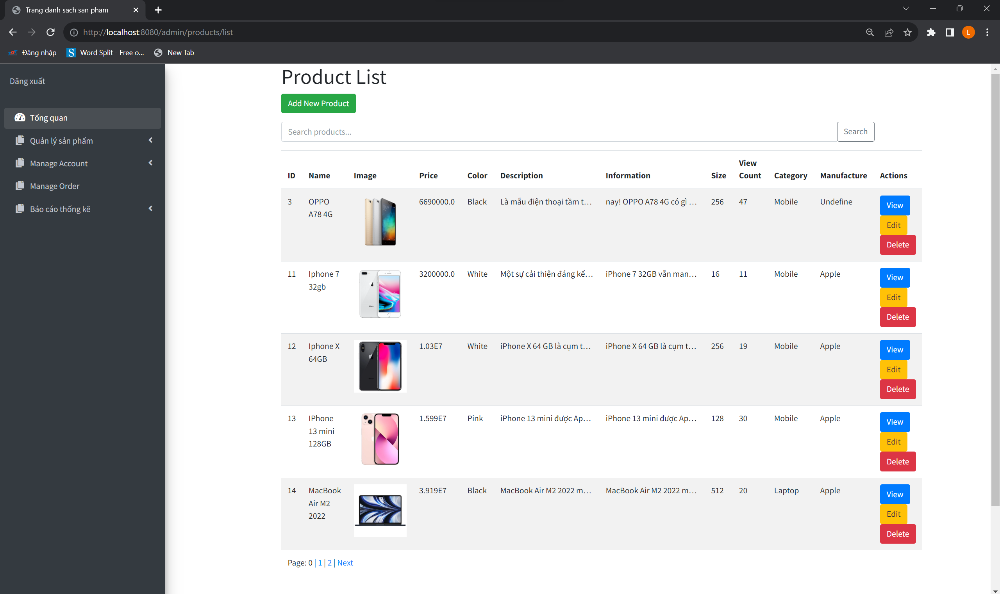
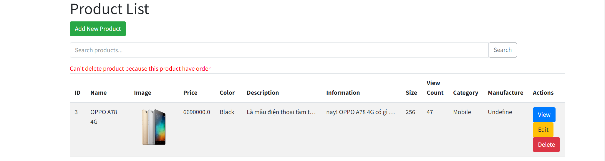
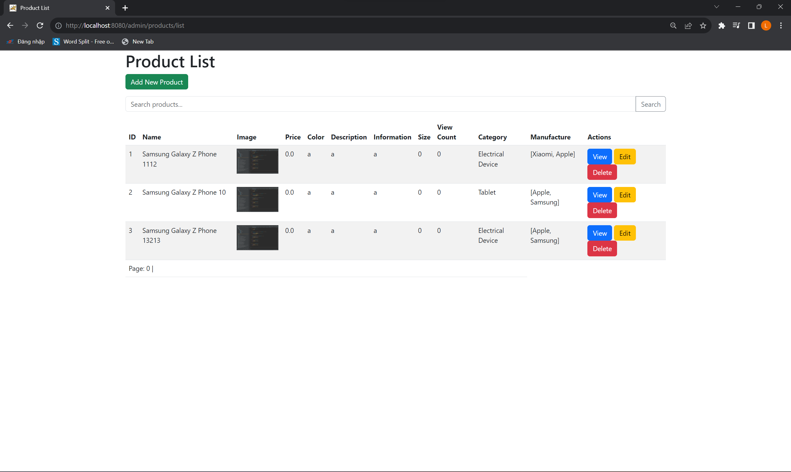
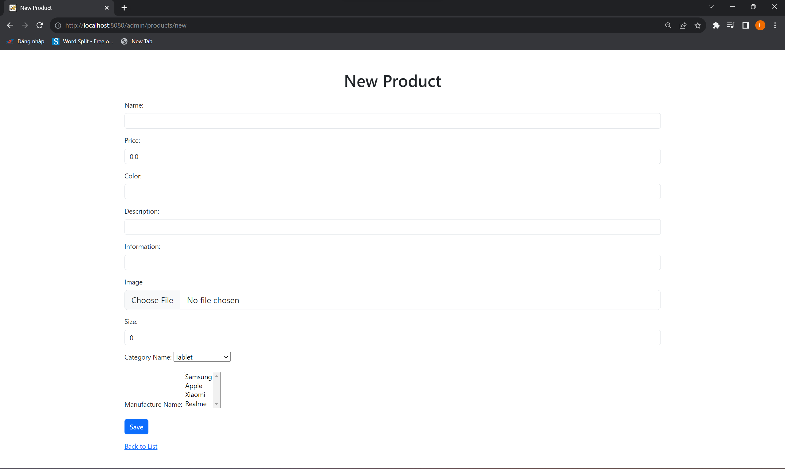
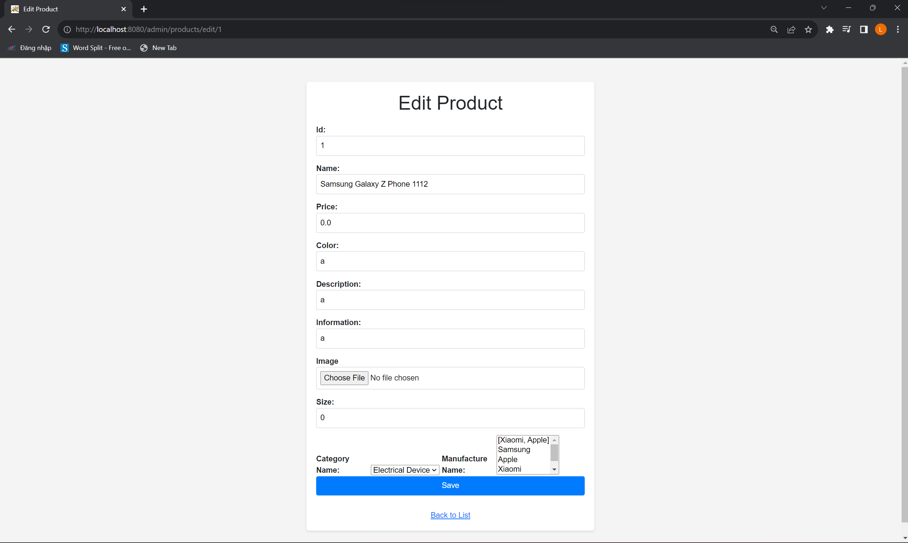
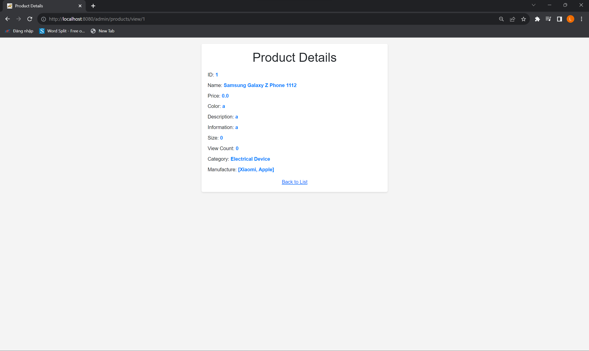

<i>--------------Version 2.1:--------------</i>
<li>Supported find manufacture name</li>    
    
    

<i>--------------Version 2.0:--------------</i>
<h1> What new !!!  </h1>
<ul>
    <li>Now we improve UI for product management website</li>
    <li>You can't delete product if that product have order</li>
</ul>
    
    

 
 
<i>--------------Version 1.0:--------------</i>
<h1> What new !!!  </h1>
<h4>In this version you can:</h4>
<ul>
    <li>Add new or edit product with category and manufacture properties</li>
    <li>Fix database auto create new data for table if product add or update</li>
    <li>Now list product will have pagination</li>
</ul>
    
    
    
    

